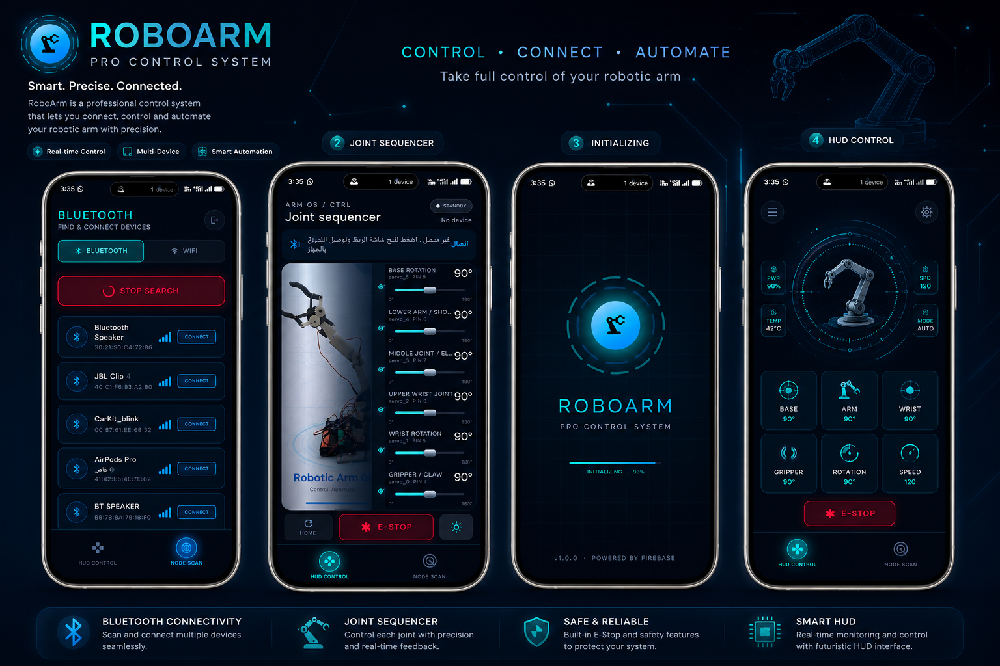
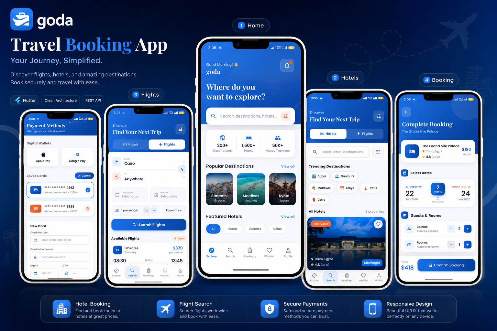
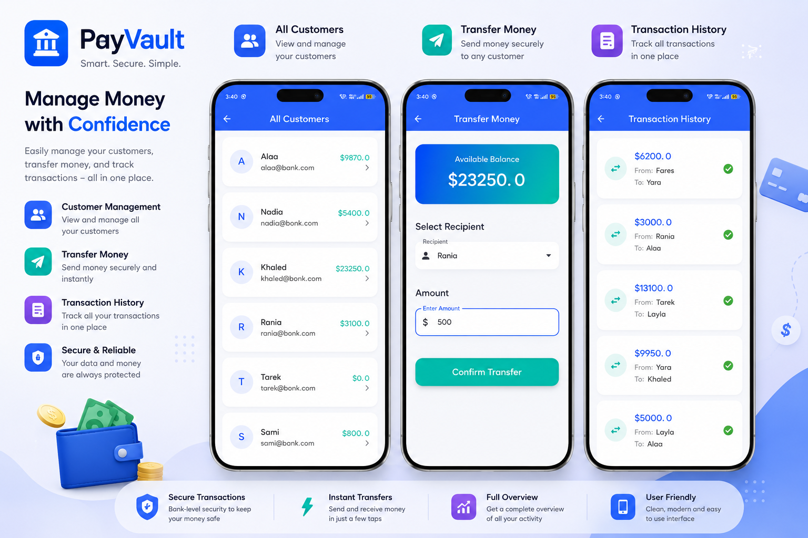
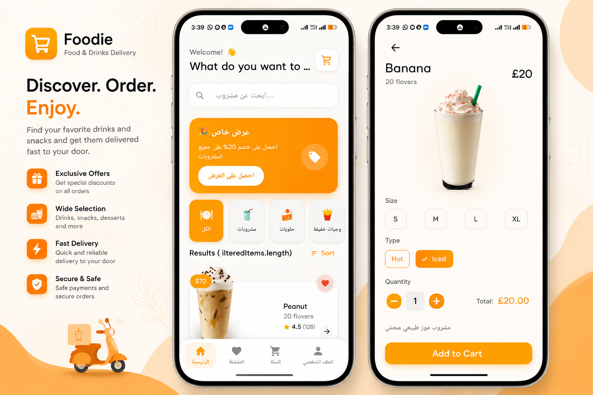
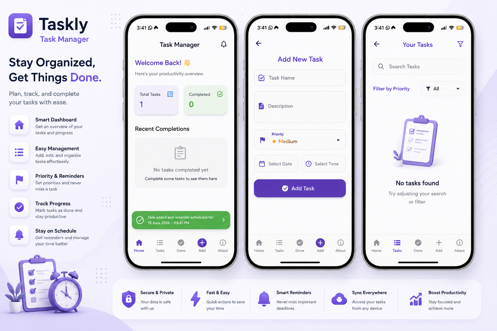
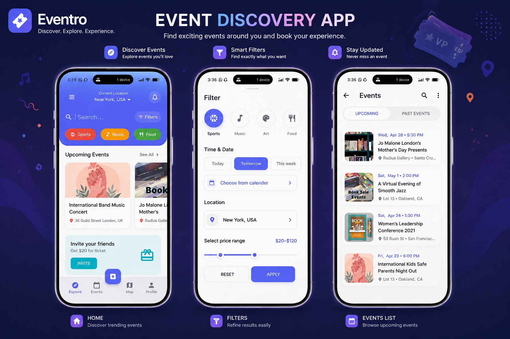

<div align="center">


<br/>

[](https://github.com/GadallahMohamed41)
[](https://github.com/GadallahMohamed41)
[](https://linkedin.com/in/gadallah-mohamed)
[](mailto:goodashalaa912@gmail.com)
[](https://linkedin.com/in/gadallah-mohamed)

</div>

---

## 👨‍💻 About Me

```dart
class GadallahMohamed extends FlutterDeveloper {

  final String name       = "Gadallah Mohamed";
  final String role       = "Flutter Developer & Mobile Engineer";
  final String location   = "Beheira, Egypt 🇪🇬";
  final String university = "New Assiut Technological University";
  final String degree     = "B.Sc. Information Technology (2026)";
  final String status     = "Open for Remote Opportunities 🌐";

  final Map<String, List<String>> stack = {
    "Mobile"    : ["Flutter", "Dart", "Android"],
    "Arch"      : ["Clean Architecture", "MVVM", "BLoC", "Provider"],
    "Backend"   : ["Firebase", "REST APIs", "SQLite", "Firestore"],
    "IoT & AI"  : ["Arduino", "OpenCV", "Bluetooth", "Wi-Fi"],
    "Languages" : ["C++", "Java", "Python", "Assembly"],
  };

  List<String> get currentFocus => [
    "📱 Building scalable cross-platform apps",
    "⚙️  Robotics & IoT control systems",
    "🤖 Integrating AI into mobile experiences",
    "🏆 Competitive Programming (ICPC)",
  ];

  String get philosophy => "Build products, not just applications.";
}
```

---

## ⚙️ Tech Stack

<div align="center">


</div>

<br/>

<div align="center">

| 📱 Mobile | 🏗 Architecture | ☁️ Backend | 🤖 AI & IoT |
|:---:|:---:|:---:|:---:|
| Flutter · Dart | Clean Arch · MVVM | Firebase · REST API | OpenCV · Arduino |
| Android · iOS | BLoC · Provider | SQLite · Firestore | Bluetooth · Wi-Fi |

</div>

---

## 🔥 Featured Projects

<div align="center">

### 🦾 Robotic Arm Control System `2026`

</div>

<div align="center">

</div>

> Real-time IoT Flutter app to control a physical robotic arm wirelessly — Mobile & Desktop.

| Feature | Details |
|---|---|
| 📡 Connectivity | Bluetooth (HC-05) + Wi-Fi dual mode |
| 🎬 Recording | Movement recording, playback, import/export |
| 🛑 Safety | Emergency stop & full joint control |
| ⚙️ Hardware | Arduino UNO + servo motors integration |

`Flutter` `Arduino` `Bluetooth` `Wi-Fi` `IoT` `Desktop`

---

<div align="center">

### ✈️ Travel & Booking App `2025`

</div>

<div align="center">

</div>

> Full-featured travel app with clean code and modern UX.

- 🔍 Smart search & booking management
- ❤️ Wishlist & multiple payment methods
- 🌙 Dark mode · Clean Architecture · BLoC

`Flutter` `BLoC` `REST API` `Clean Architecture`

---

<div align="center">

### 🔒 Smart Security App `2024`

</div>

> Real-time IoT home security system with Flutter.

- 🚨 Live alerts & remote control
- 🔔 Firebase push notifications
- 📡 IoT device integration

`Flutter` `Firebase` `FCM` `IoT`

---

<div align="center">

### 🏦 Bank App `2024`

</div>

<div align="center">

</div>

> Secure Flutter banking app with full transaction management.

- 💳 Secure balance transfers
- 🗄️ SQLite local database
- 🎨 Clean financial UI design

`Flutter` `SQLite` `Dart`

---

<div align="center">

### 🛒 Shop App `2024`

</div>

<div align="center">

</div>

> Flutter-based e-commerce application with a responsive, Arabic-friendly UI.

- 🛍️ Product browsing, search & categories
- ❤️ Favorites & cart management
- 📦 Order management & quantity selection
- 🌐 Backend API integration

`Flutter` `REST API` `E-Commerce` `UI/UX`

---

<div align="center">

### ✅ Task Manager App `2024`

</div>

<div align="center">

</div>

> Smart task-tracking app with state management.

`Flutter` `Provider` `UI/UX`

---

<div align="center">

### 📅 Book Event App `2023`

</div>

<div align="center">

</div>

> Flutter-based event booking application with map integration and full booking flow.

- 🔍 Event discovery, search & filtering
- 🗺️ Map integration
- 📆 Booking, calendar, profile & messaging
- ⭐ Reviews · REST APIs · optimized for Android & iOS

`Flutter` `REST API` `Maps` `Clean Architecture`

---

## 💼 Experience

<div align="center">

```
┌─────────────────────────────────────────────────────────┐
│  🎓 Flutter Teaching Assistant — TechUP Academy         │
│  📅 Dec 2025 → Present                                  │
└─────────────────────────────────────────────────────────┘
```

</div>

- ▸ Delivered Flutter & Dart sessions alongside senior instructors
- ▸ Debugged live code and guided students through hands-on projects
- ▸ Simplified complex mobile development concepts for better comprehension
- ▸ Reviewed assignments and provided structured, constructive feedback

---

## 📊 GitHub Stats

<div align="center">


</div>

<div align="center">


</div>

---

## 📈 Contribution Graph

<div align="center">


</div>

---

## 🏆 GitHub Trophies

<div align="center">


</div>

---

## 🏅 Certifications & Achievements

<div align="center">

| 🏅 | Achievement | Issuer |
|:---:|---|---|
| 🥇 | **Top 3 Achiever — GAIC Program** | EU-funded · National Council for Women |
| 📜 | **Mobile App Development Diploma** | Information Technology Institute (ITI) |
| 📜 | **SprintUp — Mobile Dev by Flutter** | Sprints |
| 📜 | **Flutter Program — 60 hrs** | Creativa · ITIDA · TIEC · MOR |
| 🏆 | **ICPC Competitive Programmer** | Regional Participant |

</div>

---

## 💡 Philosophy

```cpp
while (alive) {
    learn();      // Never stop growing
    build();      // Ship real products
    improve();    // Refactor ruthlessly
    repeat();     // Consistency wins
}
```

---

## 🌍 Connect With Me

<div align="center">

[](mailto:goodashalaa912@gmail.com)

[](https://github.com/GadallahMohamed41)

[](https://linkedin.com/in/gadallah-mohamed)

</div>

---

<div align="center">

### 🇸🇦 Arabic (Native) &nbsp;·&nbsp; 🇬🇧 English B2 &nbsp;·&nbsp; 🌐 Open for Remote Work


</div>
